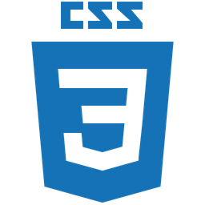

# Career Development Plan 🎓

---

## Project Description 🧾

The Career Development Plan Kanban Board is a simple project management tool designed to help aspiring developers organize and track their progress toward launching a new career. Inspired by agile principles, it uses a classic Kanban layout with three stages—🔵TODO, 🟣DOING, and 🟢DONE—to visually manage tasks and milestones. The board promotes focus, persistence, and structured growth, offering users a clear overview of their journey. Although centred on tech careers, the concept can be easily adapted for various goals and projects.

---

## Technologies Used 👨🏽‍💻

---

## Features 🛠️

### Created

- Favicon for the website to look professsional
- Static side panel with a logo

### Updated

- Responsive design for mobile compatibility
- Task cards behave like a link, changing color when hovering/ focusing
- Javascripts for 2 new task prompts

---

## Setup Instructions 🧩

1.  **Create a New Board:**
    Create a new board and name it to represent your project.
2.  **Define Columns:**
    Set up the necessary columns to represent your workflow stages (e.g., TODO, DOING, DONE). You can customize these based on your specific needs.
3.  **Create Cards (Tasks):** Add individual tasks as cards within the "TODO" column.
4.  **Execute:**
    Save the project and start working.

---

## Usage Instructions 🪄

1. Start with the To Do column.

2. Move tasks you're actively working on into the Doing column.

3. Once completed, shift them to the Done column.

4. Celebrate each milestone you complete!
